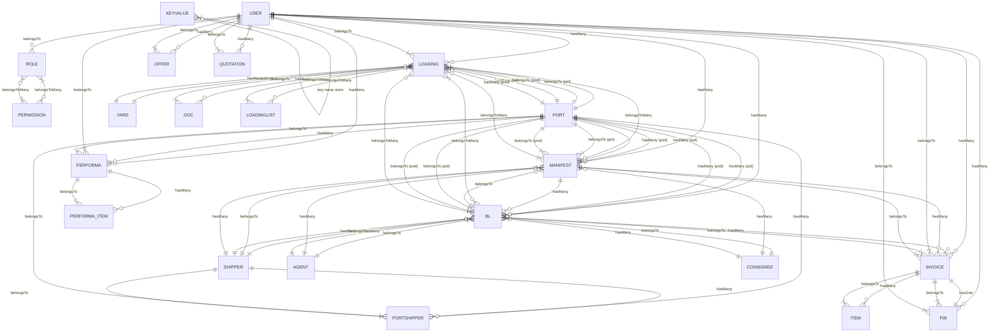

# Duna Legacy Dashboard — Domain Model

## Entity Relationship Diagram (Mermaid)

## 23 Domain Entities — Detailed Spec

### 1. User (Auth + RBAC)
| Field | Type | Notes |
|---|---|---|
| id | bigInteger (PK) | |
| fname, lname | string | First/last name |
| email | string (unique) | |
| password | string (hashed) | |
| mobile | string | |
| level | enum: 'Admin' \| 'User' | Simple tier |
| active | boolean | |
| role_id | foreignId → Role | RBAC |
| avatar | string | Path in `uploads/avatars/` |
| timestamps | | |

**Relationships**: roles, loadings, offers, quotations, manifests, bls, invoices, fins, performas

---

### 2. Role
| Field | Type | Notes |
|---|---|---|
| id | bigInteger (PK) | |
| name | string (unique) | e.g., 'admin', 'operator' |
| label | string | Display name |
| timestamps | | |

**Relationships**: permissions (many-to-many), users (hasMany)

---

### 3. Permission
| Field | Type | Notes |
|---|---|---|
| id | bigInteger (PK) | |
| name | string (unique) | e.g., 'loadings.show' |
| label | string | |
| timestamps | | |

**Relationships**: roles (many-to-many)

---

### 4. Shipper (صاحب بار / فرستنده)
| Field | Type | Notes |
|---|---|---|
| id | bigInteger (PK) | |
| title | string | Company/name |
| timestamps | | |

**Relationships**: bls, manifests, portshippers

---

### 5. Agent (نمایندگی)
| Field | Type | Notes |
|---|---|---|
| id | bigInteger (PK) | |
| title | string | |
| timestamps | | |

**Relationships**: manifests, bls

---

### 6. Consignee (گیرنده / مشتری مقصد)
| Field | Type | Notes |
|---|---|---|
| id | bigInteger (PK) | |
| title | string | |
| timestamps | | |

**Relationships**: manifests, bls

---

### 7. Port (بندر)
| Field | Type | Notes |
|---|---|---|
| id | bigInteger (PK) | |
| title | string | Port name |
| timestamps | | |

**Relationships**: loadings (pol/pod), manifests (pol/pod), bls (pol/pod), portshippers, performas

---

### 8. Yard (حیاط / انبار)
| Field | Type | Notes |
|---|---|---|
| id | bigInteger (PK) | |
| title | string | Yard name/location |
| timestamps | | |

**Relationships**: loadings (hasMany)

---

### 9. Loading (بارگیری / محموله)
| Field | Type | Notes |
|---|---|---|
| id | bigInteger (PK) | |
| number | string | Loading number |
| user_id | foreignId → User | Operator |
| pol_id | foreignId → Port | Port of loading |
| pod_id | foreignId → Port | Port of discharge |
| yard_id | foreignId → Yard | Yard location |
| admin_status | enum | PENDING, APPROVED |
| status | enum | LOADED, IN_YARD |
| in_status | enum | PENDING, DONE, LOCAL_ED, NO_NEED |
| total_weight | decimal | |
| total_unit | integer | |
| timestamps | | |

**Relationships**: user, pol, pod, yard, docs, bls (M2M), manifests (M2M), loadinglists (M2M)

---

### 10. Loadinglist (لیست بار)
| Field | Type | Notes |
|---|---|---|
| id | bigInteger (PK) | |
| timestamps | | |

**Relationships**: loadings (M2M)

---

### 11. Bl (Bill of Lading / بارنامه)
| Field | Type | Notes |
|---|---|---|
| id | bigInteger (PK) | |
| number | string | B/L number |
| vessel | string | Vessel name (NOT a model) |
| shipper_id | foreignId → Shipper | |
| agent_id | foreignId → Agent | |
| consignee_id | foreignId → Consignee | |
| pol_id | foreignId → Port | Port of loading |
| pod_id | foreignId → Port | Port of discharge |
| manifest_id | foreignId → Manifest | Optional link |
| user_id | foreignId → User | Creator |
| total_weight | decimal | |
| total_unit | integer | |
| status | enum | PENDING, RELEASED |
| timestamps | | |

**Relationships**: shippers, agents, consignees, pol, pod, manifest, user, invoices, loadings (M2M)

---

### 12. Manifest (مانیفست / لیست بار کشتی)
| Field | Type | Notes |
|---|---|---|
| id | bigInteger (PK) | |
| number | string | Auto-generated per pod |
| vessel | string | Vessel name |
| voyage | string | Auto-generated per shipper+pod |
| shipper_id | foreignId → Shipper | |
| user_id | foreignId → User | |
| pol_id | foreignId → Port | |
| pod_id | foreignId → Port | |
| gas_cost, lashing_cost, shipper_cost, pod_cost, pol_cost | decimal | Cost breakdown |
| total_weight | decimal | Aggregated from BLs |
| total_unit | integer | Aggregated from BLs |
| timestamps | | |

**Relationships**: shippers, pol, pod, user, bls, invoices, loadings (M2M)

---

### 13. Invoice (فاکتور)
| Field | Type | Notes |
|---|---|---|
| id | bigInteger (PK) | |
| code | string | Auto-generated |
| title | string | Description |
| bl_id | foreignId → Bl | |
| manifest_id | foreignId → Manifest | |
| user_id | foreignId → User | |
| status | enum | PAID, UNPAID |
| timestamps | | |

**Relationships**: items, user, bl, manifest, fins (hasOne)

---

### 14. Item (مورد فاکتور)
| Field | Type | Notes |
|---|---|---|
| id | bigInteger (PK) | |
| invoice_id | foreignId → Invoice | |
| description | string | |
| amount | decimal | |
| timestamps | | |

**Relationships**: invoice

---

### 15. Fin (مالي / قبض/دفع)
| Field | Type | Notes |
|---|---|---|
| id | bigInteger (PK) | |
| invoice_id | foreignId → Invoice | |
| user_id | foreignId → User | |
| type | enum | 'Sales/Payment', 'Received' |
| amount | decimal | |
| timestamps | | |

**Relationships**: invoice, user

---

### 16. Performa (پیش‌فاکتور)
| Field | Type | Notes |
|---|---|---|
| id | bigInteger (PK) | |
| user_id | foreignId → User | |
| port_id | foreignId → Port | |
| timestamps | | |

**Relationships**: user, port, performa_items

---

### 17. Performa_item (مورد پیش‌فاکتور)
| Field | Type | Notes |
|---|---|---|
| id | bigInteger (PK) | |
| performa_id | foreignId → Performa | |
| description | string | |
| amount | decimal | |
| timestamps | | |

**Relationships**: performa

---

### 18. Quotation (اقتباس / پیشنهاد قیمت)
| Field | Type | Notes |
|---|---|---|
| id | bigInteger (PK) | |
| user_id | foreignId → User | |
| timestamps | | |

**Relationships**: user

---

### 19. Offer (پیشنهاد)
| Field | Type | Notes |
|---|---|---|
| id | bigInteger (PK) | |
| user_id | foreignId → User | |
| timestamps | | |

**Relationships**: user

---

### 20. Doc (سند / مدرک)
| Field | Type | Notes |
|---|---|---|
| id | bigInteger (PK) | |
| loading_id | foreignId → Loading | |
| file_path | string | |
| timestamps | | |

**Relationships**: loading

---

### 21. Portshipper (بندر-صاحب بار)
| Field | Type | Notes |
|---|---|---|
| id | bigInteger (PK) | |
| port_id | foreignId → Port | |
| shipper_id | foreignId → Shipper | |
| timestamps | | |

**Relationships**: port, shipper

---

### 22. KeyValue (تنظیمات کلید-مقدار)
| Field | Type | Notes |
|---|---|---|
| key | string (PK) | |
| value | text | |
| context | string | |
| timestamps | false | |

---

### 23. HasRole (Trait) — Not a model

---

## Module Clusters (for Agent Assignment)

| Cluster | Models | Primary Agent |
|---|---|---|
| **Operations** | Loading, Loadinglist, Yard, Port, Doc | Operations Agent |
| **Manifest & B/L** | Manifest, Bl, Shipper, Agent, Consignee, Portshipper | Manifest Agent |
| **Finance** | Invoice, Item, Fin, Performa, Performa_item, Quotation, Offer | Finance Agent |
| **Users & Auth** | User, Role, Permission, KeyValue | Auth/Security Agent |
| **Documents** | Doc (uploads) | Document Agent |

---

## Missing Entities (GAPs from Client Requirements)

| Missing Entity | Client Module | Suggested Fields |
|---|---|---|
| **Vessel** | Manifest & B/L → Vessel | id, name, imo, flag, capacity, owner, timestamps |
| **Ledger** | Accounting → Ledger | id, date, account_code, debit, credit, description, ref_type, ref_id, timestamps |
| **DeliveryOrder** | Accounting → Delivery Order | id, bl_id, manifest_id, issue_date, recipient, status, timestamps |
| **ReleaseOrder** | Accounting → Release Order | id, bl_id, release_date, authorized_by, status, timestamps |
| **Salary** | Accounting → Salary | id, user_id, period, base, allowances, deductions, net, status, timestamps |
| **FinancialReport** | Accounting → Financial Reports | id, type, period, generated_at, file_path, status |
| **Letter** | Letters | id, type, subject, body, recipient, status, timestamps |
| **Customer** | Customers | id, company_name, contact_person, email, phone, address, type (shipper/consignee/agent), timestamps |