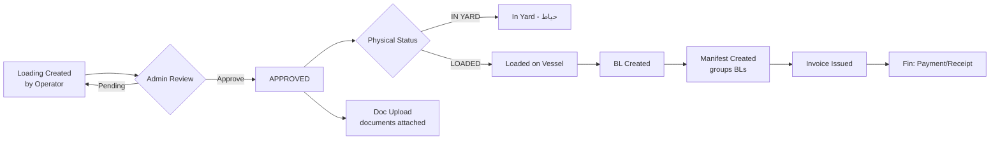
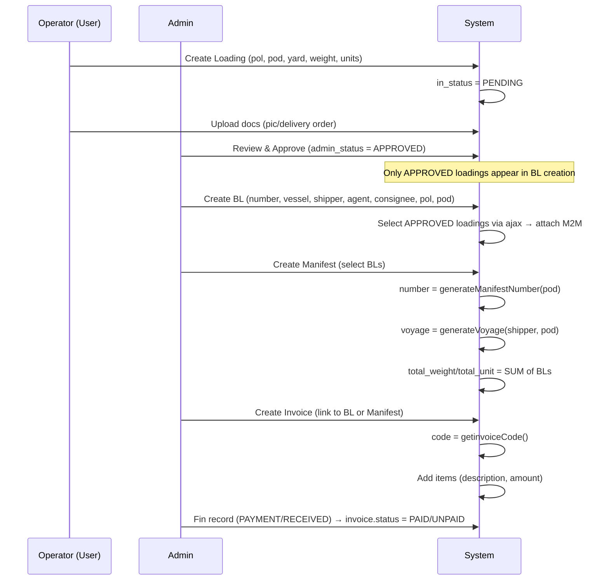

# Duna Legacy Dashboard — Workflows

## Complete Business Flows (from code analysis)

### 1. Cargo Lifecycle (اصلی‌ترین گردش کار)

### 2. Loading → Manifest → Invoice Flow (Sequential)

### 3. Numbering & Auto-generation Rules

| Entity | Rule | Code Location |
|---|---|---|
| Manifest.number | `generateManifestNumber(pod_id)` — per-port sequence | `app/Helpers/helpers.php:132-148` |
| Manifest.voyage | `generateVoyage(shipper_id, pod_id)` — shipper+destination | `app/Helpers/helpers.php` |
| Invoice.code | `getinvoiceCode()` — sequential | `app/Helpers/helpers.php:178-187` |
| User avatar | timestamp + original name, 200x200 fit | `User::uploadAvatar()` |

### 4. Status Machines

**Loading — three parallel status tracks:**
| Track | Values | Meaning |
|---|---|---|
| `admin_status` | PENDING → APPROVED | Admin approval gate |
| `status` | LOADED, IN_YARD | Physical state |
| `in_status` | PENDING, DONE, LOCAL ED, NO NEED | Document/office state |

**BL status:** PENDING → RELEASED (بعد از تسویه/آزادسازی)

**Invoice status:** PAID / UNPAID (changed via `change-payment` route + Fin records)

**Fin type:** 'Sales/Payment' vs 'Received'

### 5. Permission Gates (RBAC Matrix)

| Permission | Guards Route |
|---|---|
| loadings.show / new / edit / delete | /admin/loading-list CRUD |
| loadings.adminapprove | /admin/loading-list/change/{id} |
| loadings.yards / yards.manage | Yard CRUD |
| loadings.ports / ports.manage | Port CRUD |
| loadings.docs | Document upload/download |
| loadinglist.show / new / edit / delete | Loading list CRUD |
| bl.show / new / edit / delete | B/L CRUD |
| manifest.show / create / edit / delete | Manifest CRUD |
| invoices.* | Invoice CRUD |
| fins.* | Financial vouchers |

**Route middleware pattern:** `->middleware('can:permission.name')`

### 6. Data Entry Points (who enters what)

| Actor | Enters | Via |
|---|---|---|
| Operator (User level) | Loading entries, docs | /admin/loading-list/new + docs |
| Admin | Approval, Yards, Ports, BL, Manifest, Invoice, Fin, Users, Roles | /admin/* |
| System | Manifest number/voyage, Invoice code, totals aggregation | helpers.php |

### 7. Key Business Rules Extracted from Code

1. **BL can only attach APPROVED loadings** (`ajaxloading`: `where('admin_status', Loading::APPROVED)`)
2. **Manifest totals = SUM of attached BLs** (total_weight, total_unit)
3. **Manifest number regenerates if pod changes**; voyage regenerates if pod or shipper changes
4. **Invoice ties to BL OR Manifest** (both FKs optional)
5. **Invoice.payment status changes only via Fin record** (`change-payment`)
6. **Search uses Persian stopword filtering** (ها، های، و، با، که، از، در) in `User::scopeSearch`
7. **Everything is user-scoped**: each record stores `user_id` (who created it) — reporting per operator possible
8. **Soft cascade**: Manifest delete → detach BLs (no hard delete of BLs)